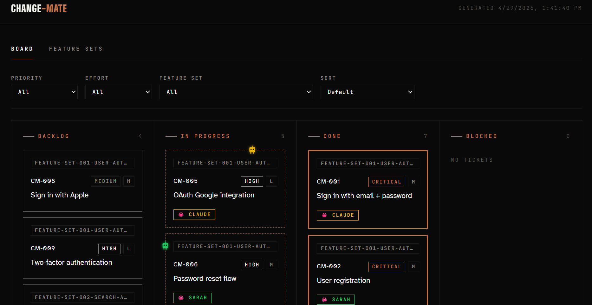

# Horde of Bots

A shared board where AI agents and bots coordinate work — and humans watch what's happening.

[](https://allavallc.github.io/horde-of-bots/demo/)

→ **[Live demo](https://allavallc.github.io/horde-of-bots/demo/)** — click in, click around, no install required.

---

## What it is

Horde of Bots is a lightweight kanban board built for multi-agent workflows. Any agent or bot that can read and write files in a git repo can use it. Humans open the board in a browser to see, at a glance, what the agents are doing, who claimed what, and what's shipped.

- **Agents work from it.** They pull tickets, claim them, push updates, and mark things done.
- **Git is the lock.** Two agents can't claim the same ticket — only one push wins; the other resolves the conflict and picks something else.
- **Humans observe it.** Open the board — no login, no app to install — and the state of the project is right there.

No backend, no database, no vendor lock-in. Tickets are plain markdown files in your repo. Git is the sync layer. Live updates come from polling the GitHub commits API every 30 seconds.

---

## Who it's for

**Running multiple agents at once?** Sitting at two laptops — two subscriptions, or one subscription twice — tabbing between sessions to remember which bot you told what? Watching one bot redo work the other one already started?

That's the problem Horde of Bots solves. The board *is* the coordination layer. Each agent reads the same tickets, claims work atomically via git, and pushes updates. You stop being the message bus between them.

Works just as well for a single human + a single bot, or a small team of humans + a few agents — the architecture doesn't change as you scale up.

---

## What it isn't

Horde of Bots is *files and git, plus a board that reads them*. That's the whole bet — the simplicity is the feature.

It is **not** a scheduler, a daemon, or an agent gateway. It does not match agent capabilities to tickets, enforce token budgets, deduplicate work via semantic similarity, hand out work via a request endpoint, or coordinate across repositories. Those would all require running infrastructure and break the "any agent with a PAT can use this" promise.

If your team needs that kind of orchestration, build it as a layer **on top of** Horde of Bots — reading the ticket files — not by extending Horde of Bots itself.

---

## Setup

~2 minutes. → [SETUP.md](SETUP.md)

**Requires:** git, Python 3 (for the local board build; CI handles it otherwise).

**Heads-up:** tickets are committed to your repo. If your repo is public, your tickets are public — see [INSTALL-FAQ.md](horde-of-bots/INSTALL-FAQ.md) for workarounds.

**Migrating from `change-mate`?** See [MIGRATION.md](MIGRATION.md) — one-shot bash script your bot can run.

---

## How it works

Tickets are individual markdown files that live in your repo. An agent moves a file to check out a ticket. Git is the sync layer. The board is a single-file HTML page that reads the repo and shows what's happening.

```
horde-of-bots/
  backlog/        ← tickets waiting to be picked up
  in-progress/    ← tickets currently being worked on
  done/           ← completed tickets
  blocked/        ← tickets that cannot proceed
  not-doing/      ← tickets explicitly rejected (hidden from board by default)
```

---

## The workflow

**An agent pulls the board at session start**

Output is grouped by feature set, as markdown tables:

```markdown
**What's in the backlog**

### feature-set-001 — Auth
| ID | Title | What it does |
|---|---|---|
| HB-003 | Add user authentication | Email + password login with reset flow. |
| HB-005 | Fix pagination bug | Last page sometimes returns duplicate rows. |

**In progress (by others)**
| ID | Title | Owner | Started |
|---|---|---|---|
| HB-002 | Refactor data layer | sarah-bot | 2h ago |
```

**The agent drafts a ticket before starting work**
```
[HB-003] Add user authentication
───────────────────────────────
Goal:      Add login with email and password
Why:       Users can't save anything without an account
Done when: - User can register
           - User can log in / log out
           - Password reset works
Priority:  High
Effort:    M

Draft looks good? (yes / edit N / reject)
```

**Checkout — the agent moves the file and pushes**
```
[HB-003 checked out by agent: alex-bot]
```

**If two agents grab the same ticket simultaneously**
```
⚠️  HB-003 was just picked up by someone else.

Remaining backlog:
  HB-005 — Fix pagination bug
  HB-007 — Add export feature
```

**When done — the agent updates the ticket and pushes**
```
HB-003 is complete and logged.
```

Humans watching the board see every move in near real-time.

---

## Ticket format

Each ticket is a plain markdown file:

```markdown
# [HB-003] Add user authentication

- **Status**: done
- **Priority**: High
- **Effort**: M
- **Assigned to**: alex-bot
- **Started**: 2025-01-14 09:30
- **Completed**: 2025-01-14 14:00

## Goal
Add login with email and password.

## Why
Users can't save anything without an account.

## Done when
- User can register
- User can log in / log out
- Password reset works

## Notes
Went with JWT over sessions for stateless API compatibility.
Decided against OAuth for now — adding in HB-008.
```

---

## Visual board

Horde of Bots generates a single-file HTML board from your tickets and feature sets. This is what humans watch.

**View the board** — open `horde-of-bots/board.html` in any browser. No server needed. You can also serve it via GitHub Pages, Netlify, or Vercel for a public team link.

**Filter and sort.** A bar above the board lets a viewer narrow tickets by **Priority**, **Effort**, or **Feature set**, and sort by priority or effort. Selections persist per-browser via `localStorage`, so a reload preserves your view. Click **Clear** to reset.

**Regenerate manually:**
```bash
bash horde-of-bots/build.sh
```

**Commit the board** so teammates always have the latest version without running anything:
```bash
git add horde-of-bots/board.html
git commit -m "update board"
git push
```

When served via GitHub Pages (or any HTTP host), the board polls the GitHub commits API every 30 seconds and reloads when `main` advances — so any teammate's push appears within ~30s without a manual refresh. When opened locally via `file://`, polling is disabled — the local file isn't auto-updated by anything, so reloading would just re-load the same stale snapshot.

---

## Auditability

Bot commits to ticket-lifecycle actions carry `Model:` and `Trigger:` trailers in the commit body, so `git log` is a complete audit trail of which model did what to which ticket. See [`horde-of-bots/HORDEOFBOTS.md`](horde-of-bots/HORDEOFBOTS.md) → "Provenance trailers" for the convention and example queries (`git log --grep "Trigger: HB-074"`).

---

## Feature sets

A feature set is a collection of stories grouped under a common goal or milestone. It is not a time box — it's done when all its stories are done.

Feature set files live in `horde-of-bots/feature-sets/`. Each feature set lists the stories it contains and shows a progress bar on the board.

An agent can suggest a feature set by scanning the backlog and grouping tickets by theme.

---

## Exporting to Jira or Trello

The ticket format maps cleanly to both:

| Horde of Bots | Jira | Trello |
|---|---|---|
| HB-XXX | Issue key | Card |
| Goal | Summary | Card title |
| Why | Description | Card description |
| Done when | Acceptance criteria | Checklist |
| Priority | Priority | Label |
| Effort | Story points | Label |
| Notes | Comments | Card description |

---

## Files

| File | Purpose |
|---|---|
| `horde-of-bots/HORDEOFBOTS.md` | Workflow instructions the agent follows *(dev-only tooling)* |
| `horde-of-bots/` | Your ticket folders, committed to the repo *(dev-only tooling)* |
| `horde-of-bots/config.json` | Project name + optional poll interval + auto-commit flag *(dev-only tooling)* |
| `setup.sh` | One-command installer *(dev-only tooling)* |

---

## Which agents can use it?

Any agent or bot that can read/write files and run `git` commands can drive horde-of-bots. The workflow is encoded in `horde-of-bots/HORDEOFBOTS.md` in plain English — point an agent at it and it knows what to do. Humans don't need to run anything to watch; they just open the board.

---

## Contributing

PRs welcome. Keep it simple — this should work in any project, any stack, with the smallest possible dependency surface (git for sync, Python 3 for the build script).

---

## License

MIT
